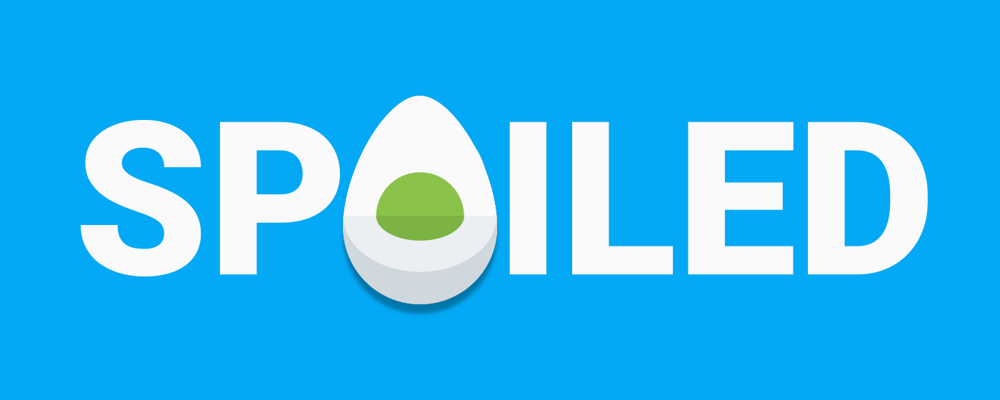
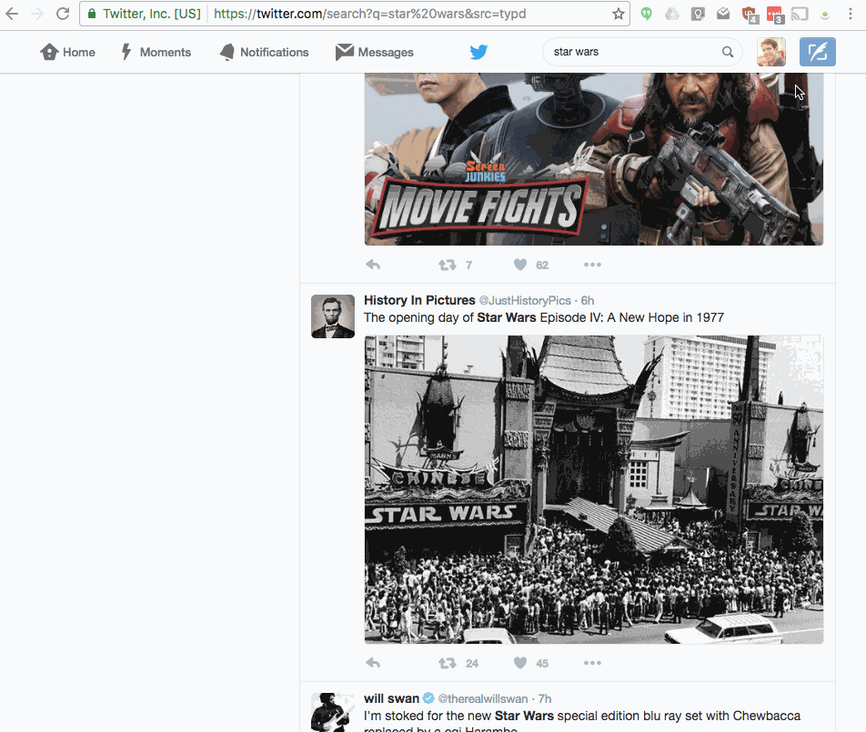

# 

# What It Is

A Chrome extension that blocks content using any provided keywords. With this unobtrusive and lightweight extension users enter custom phrases to block anything from TV spoilers to celebrity click-bait. Spoiled will scan pages for entered phrases and hide any nearby content using those phrases, including nearby images.

# How to Install It

This can be installed from the [Chrome Web Store](https://chrome.google.com/webstore/detail/spoiled/ofgoaiodajmkpocgdkjlokhhbpeodnci) just like any other extension. To make changes to the source code of the extension, follow the instructions below.

# Tips

With the support of Regex, we can do some pretty neat blocking. Here's one of my favorites, the below string blocks content that contains two words (in this case "arrival" and "alien") within six words of each other (in either order).

    \b(?:arrival\W+(?:\w+\W+){0,6}?alien|alien\W+(?:\w+\W+){0,6}?arrival)\b

# How to Contribute
I'd love help from any other spoiler haters out there. This is my first Chrome extension and my javascript skills are in a constant state of staleness.

## Principles

**Let's make this thing...**
* Fast
* Simple and usable
* Pretty
* Configurable

**Things we don't like about other extensions**
* Social logins
* User data collection
* Slow and heavy-handed

## Download Source Code

#### Instructions for beginning development
1. Download this repository.
2. Follow [Chrome's documentation](https://developer.chrome.com/extensions/getstarted) for getting started developing extensions.
3. Plugin content is inside the **_spoiled-chrome-extension_** folder. That's the folder that you should load from the **_chrome://extensions_** screen.
4. Style and branding content is in the **_assets_** folder -- [Less](http://lesscss.org/) is used for CSS pre-processing.

#### Dependency - Less

Less is used to simplify the CSS creation and has the added value of minifying
the stylesheet. The less stylesheet is not stored with the plugin, instead,

    assets/style.less

    compiles to spoiled-chrome-extension/style.css

To make changes to the style, make sure to edit the .less file.

## Git Workflow

I use [GitHub Flow](https://guides.github.com/introduction/flow/) for my Git process. Feel free to fork and contribute pull requests against the master branch. This is a side project for me but I'll do my best to review them.

## Test and Deploy

You can test by loading the unpacked extension in developer mode of [chrome://extensions](chrome://extensions) (see Chrome's docs). Currently there are no automated tests.

To promote to production, just tick up the version in the manifest, zip up the **spoiled-chrome-extension** directory, and upload it to the [Chrome developer dashboard](https://chrome.google.com/webstore/developer/).

    zip -r spoiled.zip ./spoiled-chrome-extension/*

## Landing Page

The Spoiled landing page is
https://lucasrowe.github.io/spoiled/.

I've been editing the page without testing locally so there is no gemfile.

Be sure to switch to the gh-pages branch: `git checkout gh-pages`
